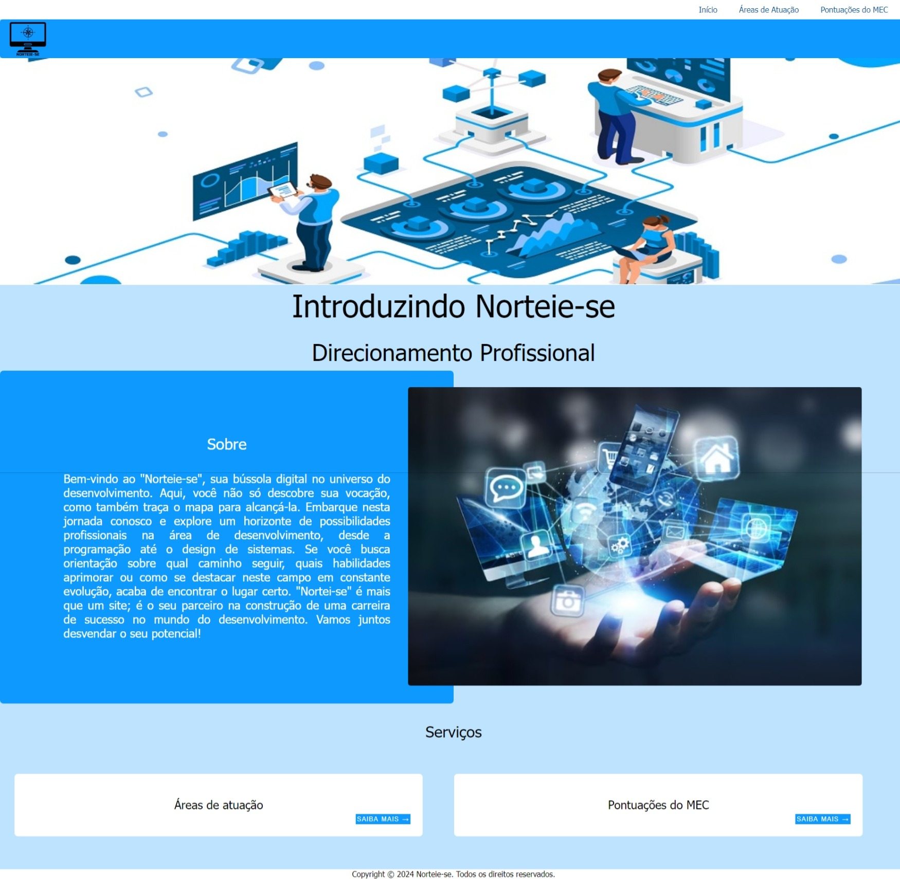
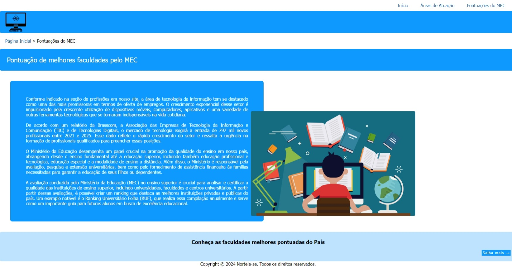
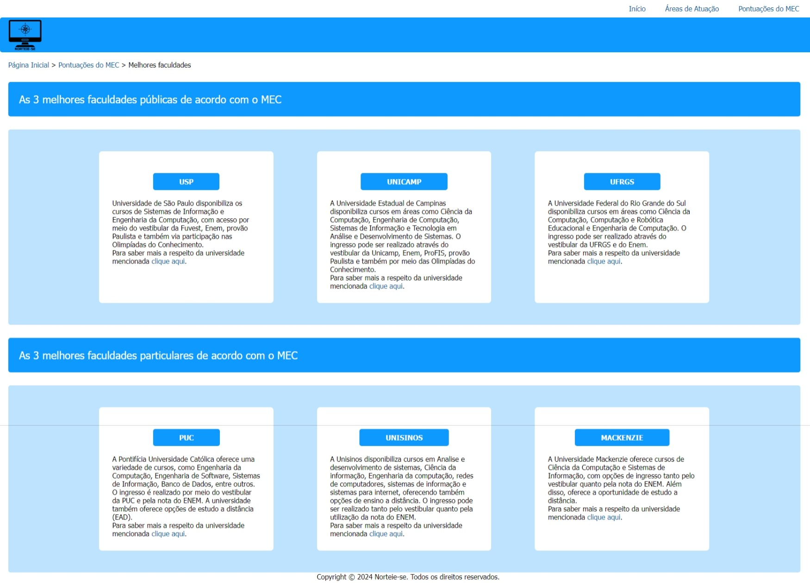
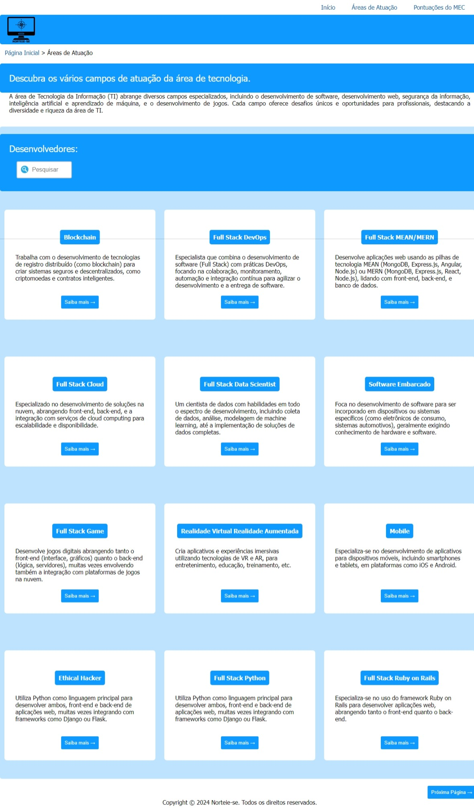
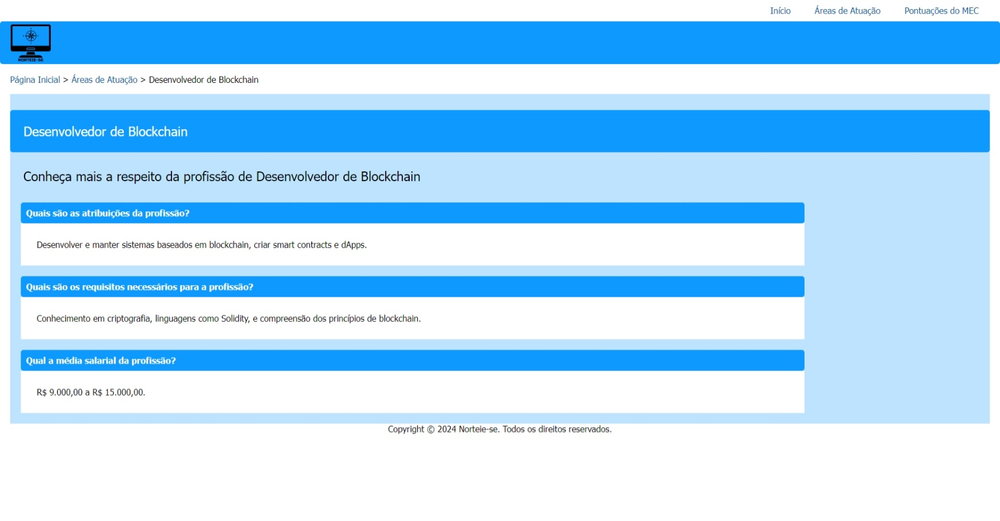

# Template padrão da Aplicação

O design básico do site foi desenvolvido utilizando as linguagens de marcação HTML, CSS e a linguagem de programação JavaScript.

As páginas incluirão elementos padrão, como o menu de navegação, cabeçalho e rodapé, juntamente com os elementos de identidade visual mencionados a seguir:
<ul>
<li>Cores: RGB: #0d99ff, #bde3ff, #053d64, #0963a3, white e black;</li>
<li>Font-family: Tahoma.</li>
<li>Font-size: Small até XX-Large.</li>
</ul>
Você pode acessar o código utilizado para criar os elementos mencionados  <a href="https://github.com/ICEI-PUC-Minas-PMV-ADS/PMV-ADS-2024-1-E1-Proj-Direcionamento-Profissional/tree/main/codigo-fonte">aqui</a>. As imagens e ícones utilizados no projeto estão disponíveis <a href="https://github.com/ICEI-PUC-Minas-PMV-ADS/PMV-ADS-2024-1-E1-Proj-Direcionamento-Profissional/tree/main/codigo-fonte/img">aqui</a>.
 
 
 
<strong>Tela Home</strong>
 
Na tela Home, os visitantes encontrarão uma breve descrição do projeto e poderão navegar pelas diferentes seções do site, como a área de profissões e a seção de classificação pelo MEC.
<figure> 
  
  <figcaption> Figura 1 - Home
</figure> 
 
 
<strong>Tela Pontuação do MEC</strong>
 
Na página de classificação do MEC, os usuários serão introduzidos a atuação do Ministério da Educação e receberão um breve relato sobre a área de tecnologia e sua demanda. Além disso, poderão explorar outras seções do site.    
<figure> 
  
  <figcaption> Figura 2 - Pontuação do MEC
</figure> 
 
 
<strong>Tela Melhores faculdades</strong>
 
Na página de melhores faculdades, os visitantes terão acesso a um ranking das melhores faculdades públicas e privadas do Brasil que oferecem cursos de tecnologia, classificadas de acordo com a pontuação atribuída pelo MEC. Eles também poderão explorar as demais seções do site.    
<figure> 
  
  <figcaption> Figura 3 - Melhores faculdades
</figure> 
 
 
<strong>Tela Areas de atuação</strong>
 
Na seção de áreas de atuação, os visitantes serão apresentados às várias carreiras de tecnologia disponíveis e poderão escolher aquela que mais lhes interessa para obter mais informações. Terão como ferramenta para auxiliar a navegação do site, uma barra de pesquisa. Eles também poderão explorar as demais seções do site.    
<figure> 
  
  <figcaption> Figura 4 - Areas de atuação
</figure> 
 
 
<strong>Tela Profissões</strong>
 
Após escolher a profissão de interesse, os usuários poderão acessar detalhes mais específicos sobre essa carreira, como suas responsabilidades, os requisitos exigidos e uma estimativa salarial.Além disso, poderão explorar outras seções do site.
<figure> 
  
  <figcaption> Figura 5 - Profissões
</figure> 
 
 
<strong>Criação do logotipo</strong>
 
O logotipo do site foi desenvolvido utilizando a cor preta. O processo de criação começou com o nome do projeto, "Norteie-se", que evoca os pontos cardeais e, por conseguinte, a rosa dos ventos, um símbolo que tem a função de orientar quem o utiliza, refletindo assim o propósito do projeto. Para destacar a ênfase na área de estudo de tecnologia, incorporamos o elemento do computador.

<figure> 
  
  <figcaption> Figura 6 - Logotipo
</figure> 
