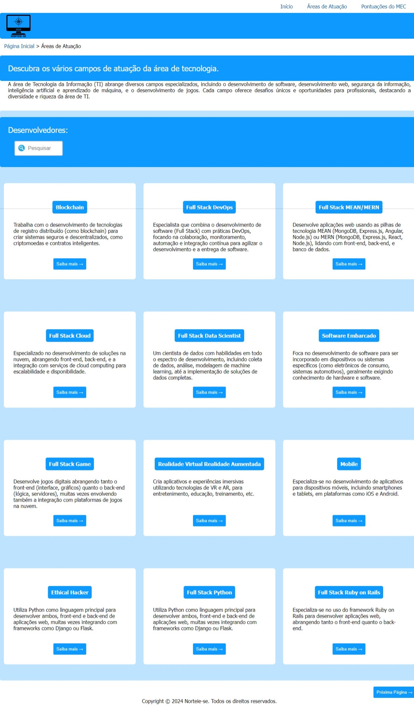
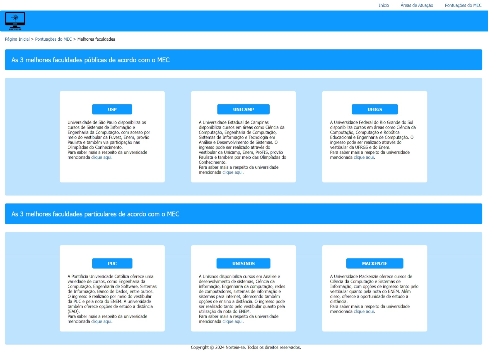

# Programação de Funcionalidades

Pré-requisitos: <a href="https://github.com/ICEI-PUC-Minas-PMV-ADS/PMV-ADS-2024-1-E1-Proj-Direcionamento-Profissional/blob/main/documentos/02-Especificação%20do%20Projeto.md"> Especificação do Projeto</a>, <a href="https://github.com/ICEI-PUC-Minas-PMV-ADS/PMV-ADS-2024-1-E1-Proj-Direcionamento-Profissional/blob/main/documentos/03-Metodologia.md"> Metodologia</a>, <a href="https://github.com/ICEI-PUC-Minas-PMV-ADS/PMV-ADS-2024-1-E1-Proj-Direcionamento-Profissional/blob/main/documentos/04-Projeto%20de%20Interface.md"> Projeto de Interface</a>.

### Tela de áreas de atuação (RF-01, RF-02)

Responsável: Cristhiane Maria Assi e Victor Emanuel de Souza.

O acesso à tela pode ser realizado por meio da opção de menu "Áreas de Atuação", presente em qualquer uma das telas do site.
Foi implementado um campo de pesquisa, onde é possivel pesquisar a sub-área pelo nome.

Exemplo da tela de áreas de atuação:
<figure> 
  
  <figcaption> Figura 1 - Áreas de atuação
</figure>
    
#### Requisito atendido
RF-01: A aplicação deve permitir ao usuário acessar informações sobre a área de desenvolvimento.	

RF-02: A aplicação deve permitir ao usuário acessar lista de sub-área.

#### Artefatos da funcionalidade
●areasdeatuacao.html

●areasdeatuacao2.html

●areasdeatuacao.css

●areasdeatuacao.js

#### Instruções de acesso
Abra um navegador de Internet e informe a seguinte URL: https://icei-puc-minas-pmv-ads.github.io/PMV-ADS-2024-1-E1-Proj-Direcionamento-Profissional/codigo-fonte/paginaAreasdeAtuacao/areasdeatuacao.html

Na tela, estão disponíveis 24 áreas de tecnologia para escolha, divididas em duas telas. O usuário pode navegar entre essas telas utilizando o botão "Próxima Página" localizado na parte inferior direita. Depois de selecionar a área desejada, é preciso clicar no botão "Saiba mais" para obter detalhes adicionais sobre a profissão escolhida.

### Telas de profissões (RF-03, RF-04)
Responsável: Cristhiane Maria Assi e Victor Emanuel de Souza.

O acesso às telas de profissões detalhadas é realizado através da tela de áreas de atuação, utilizando o botão "Saiba mais" associado a cada profissão.

Exemplo da tela de profissões: 

<figure> 
  
  <figcaption> Figura 2 - Telas de profissões
</figure>

#### Requisito atendido
RF-03: A aplicação deve permitir ao usuário acessar descrição detalhada da sub-área selecionada.

RF-04: A aplicação deve permitir ao usuário acessar planos de estudos para a sub-área selecionada.

#### Artefatos da funcionalidade
●desenvolvedor.css

●automacao.html

●backEnd.html

●blockchain.html

●frontend.html

●fullStack.html

●fullStackCloud.html

●fullStackDataScientist.html

●fullStackDevOps.html

●fullStackGame.html

●fullStackJava.html

●fullStackJavaScript.html

●fullStackMeanMern.html

●fullStackNET.html

●fullStackPHP.html

●fullStackPython.html

●fullStackRubyonRails.html

●inteligenciaArtificial.html

●jogos.html

●mobile.html

●realidadeVirtualRealidadeAumentada.html

●segurançaEthicalHacker.html

●sistemasInfraestrutura.html

●softwareEmbarcado.html

●web.html

#### Instruções de acesso
Abra um navegador de Internet e informe a seguinte URL: https://icei-puc-minas-pmv-ads.github.io/PMV-ADS-2024-1-E1-Proj-Direcionamento-Profissional/codigo-fonte/paginaAreasdeAtuacao/blockchain.html

Após selecionar a profissão desejada através do botão "Saiba mais", o usuário terá acesso à tela de detalhamento da profissão, que inclui informações sobre as atribuições da profissão, os requisitos necessários e a média salarial associada.

### Telas de pontuação do MEC (RF-05)
Responsável: Ana Clara Dunningham, Ana Izabel de Sá Carvalho e Karina Reis.

O acesso às telas pode ser feito através da opção de menu "Pontuações do MEC", disponível em todas as páginas do site. Em seguida, o usuário pode acessar o botão "Saiba Mais" localizado na parte inferior da tela para visualizar informações sobre as faculdades.

Exemplo da tela de cadastro: 

<figure> 
  
  <figcaption> Figura 3 - Tela introdução MEC
</figure>

<figure> 
  
  <figcaption> Figura 4 - Tela Melhores faculdades
</figure>

#### Requisito atendido
(RF-05): A aplicação deve permitir ao usuário acessar melhores instituições validadas pelo MEC.

#### Artefatos da funcionalidade
●introducaoMEC.html

●introducaoMEC.css

●pontuacaoMEC.html

●pontuacaoMEC.css

#### Instruções de acesso
Abra um navegador de Internet e informe a seguinte URL: https://icei-puc-minas-pmv-ads.github.io/PMV-ADS-2024-1-E1-Proj-Direcionamento-Profissional/codigo-fonte/paginaPontuacaodoMec/introducaoMEC.html

Na tela de introdução ao MEC, os usuários encontrarão informações sobre a área de tecnologia e detalhes fornecidos pelo Ministério da Educação sobre a pontuação das faculdades e rankings. Ao clicar no botão "Saiba mais" no canto inferior direito da tela, terão acesso às três melhores faculdades privadas e às três melhores faculdades públicas. Eles também poderão acessar o site de cada instituição para obter mais informações, clicando no botão "clique aqui" na descrição de cada faculdade.
